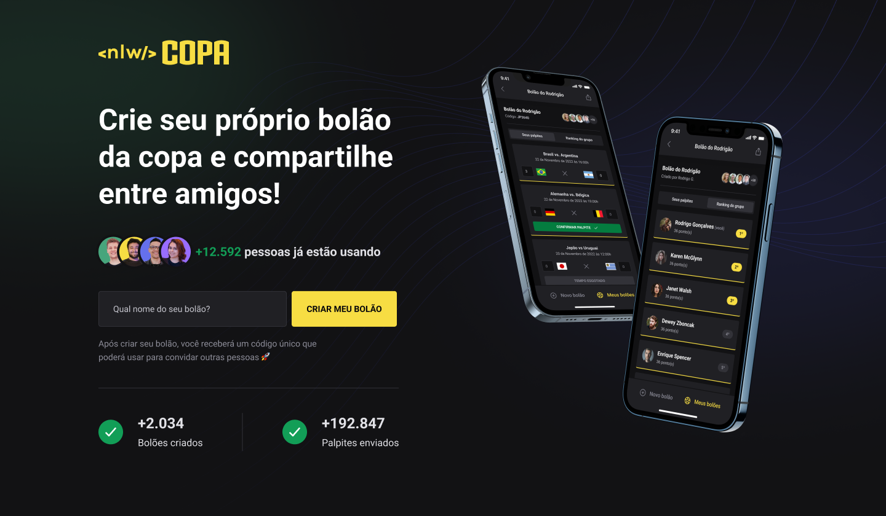
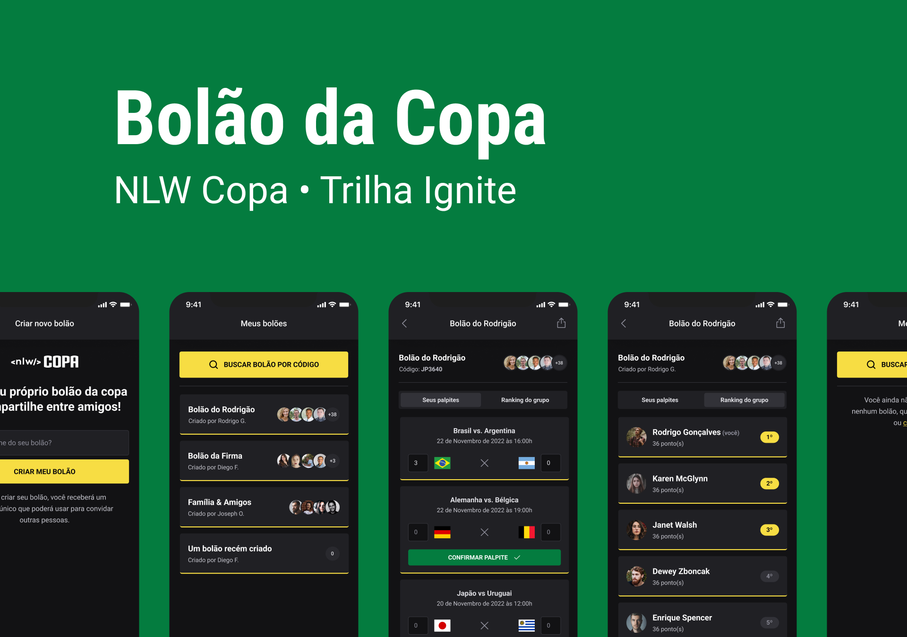

# nlw_copa

Projeto desenvolvido durante o NLW Copa em Novembro de  2022  
Projeto consta com um aplicativo.Para listar bolões da copa do mundo, onde cadastramos: 
- Jogos via API Rest
- Autentificação com o email do Google
- Categorização para diversos bolões.

## Imagens

  
  

## Modelo de dados

## Tecnologias

Este projeto foi feito utilizando as seguintes tecnologias:
### Servidor
- [Fastify](https://www.fastify.io/)
- [Typescript](https://www.typescriptlang.org/)
- [short-unique-id](https://www.npmjs.com/package/short-unique-id)
- [zod](https://zod.dev/)
### Mobile
- [Axios](https://github.com/axios/axios)
- [Expo](https://docs.expo.dev/get-started/installation/)
- [Native Base](https://nativebase.io/)
### Web
- [NextJS](https://nextjs.org/)

## Layout
To access the layout use <a href='https://www.figma.com/file/kwLAEZmyDB2NuvMNi87XGF/Bol%C3%A3o-da-Copa-(Community)?node-id=0%3A1'>Figma.</a>